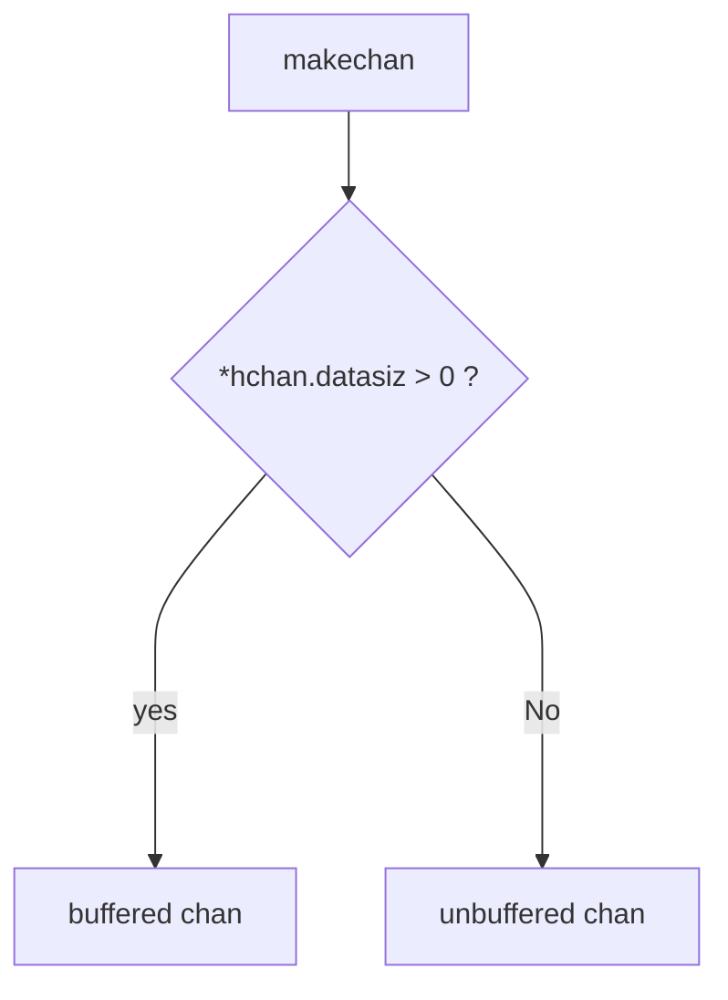
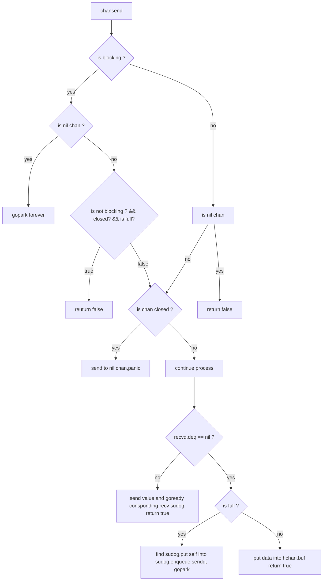
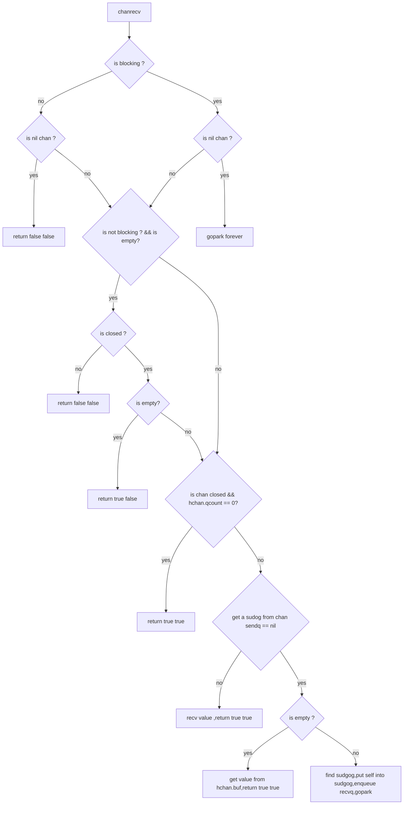

# chan相关的一些函数调用

## channel 结构体定义

```go
type hchan struct {
 qcount   uint           // total data in the queue
 dataqsiz uint           // size of the circular queue
 buf      unsafe.Pointer // points to an array of dataqsiz elements
 elemsize uint16
 closed   uint32
 elemtype *_type // element type
 sendx    uint   // send index
 recvx    uint   // receive index
 recvq    waitq  // list of recv waiters
 sendq    waitq  // list of send waiters

 // lock protects all fields in hchan, as well as several
 // fields in sudogs blocked on this channel.
 //
 // Do not change another G's status while holding this lock
 // (in particular, do not ready a G), as this can deadlock
 // with stack shrinking.
 lock mutex
}
```

## chan 的创建



[](https://mermaid.live/edit#eyJjb2RlIjoiZmxvd2NoYXJ0IFREXG4gICAgQVttYWtlY2hhbl0gLS0-IEJ7KmhjaGFuLmRhdGFzaXogID4gMCA_fTtcbiAgICBCIC0tIHllcyAtLT4gQ1tidWZmZXJlZCBjaGFuXTtcbiAgICBCIC0tIE5vIC0tPiBFW3VuYnVmZmVyZWQgY2hhbl07XG4iLCJtZXJtYWlkIjoie1xuICBcInRoZW1lXCI6IFwiZGVmYXVsdFwiXG59IiwidXBkYXRlRWRpdG9yIjpmYWxzZSwiYXV0b1N5bmMiOnRydWUsInVwZGF0ZURpYWdyYW0iOmZhbHNlfQ)

## chansend

- `func chansend(c *hchan, ep unsafe.Pointer, block bool, callerpc uintptr) bool`
- chan 发送(ch <- data)被转换成 runtime.chansend() 操作.形参 block 表示是否阻塞调用.
- 返回值表示是否成功向 chan 发送数据.



[![](https://mermaid.ink/img/eyJjb2RlIjoiZmxvd2NoYXJ0IFREXG4gICAgQVtjaGFuc2VuZF0gLS0-IEJ7aXMgYmxvY2tpbmcgP307XG4gICAgQiAtLSB5ZXMgLS0-IEN7aXMgbmlsIGNoYW4gP307XG4gICAgQyAtLSB5ZXMgLS0-IERbZ29wYXJrIGZvcmV2ZXJdO1xuICAgIEMgLS0gbm8gLS0-IEZ7aXMgbm90IGJsb2NraW5nID8gJiYgY2xvc2VkPyAmJiBpcyBmdWxsP307XG4gICAgQiAtLSBubyAtLT4gRVtpcyBuaWwgY2hhbl07XG4gICAgRiAtLSB0cnVlIC0tPiBHW3JldXR1cm4gZmFsc2VdXG4gICAgRiAtLSBmYWxzZSAtLT4gSHtpcyBjaGFuIGNsb3NlZCA_fVxuICAgIEUgLS0geWVzIC0tPiBFMVtyZXR1cm4gZmFsc2VdXG4gICAgRSAtLSBubyAtLT4gXG4gICAgSCAtLSB5ZXMgLS0-IEgxW3NlbmQgdG8gbmlsIGNoYW4scGFuaWNdXG4gICAgSCAtLSBubyAtLT4gSDJbY29udGludWUgcHJvY2Vzc11cbiAgICBIMiAtLS0-IEgze3JlY3ZxLmRlcSA9PSBuaWwgP31cbiAgICBIMyAtLSBubyAtLT4gSDRbc2VuZCB2YWx1ZSBhbmQgZ29yZWFkeSBjb25zcG9uZGluZyByZWN2IHN1ZG9nIHJldHVybiB0cnVlXVxuICAgIEgzIC0tIHllcyAtLT4gSDV7aXMgZnVsbCA_fSBcbiAgICBINSAtLSB5ZXMgLS0-IEg2W2ZpbmQgc3Vkb2cscHV0IHNlbGYgaW50byBzdWRvZyxlbnF1ZXVlIHNlbmRxLCBnb3BhcmtdXG4gICAgSDUgLS0gbm8gLS0-IEg3W3B1dCBkYXRhIGludG8gaGNoYW4uYnVmIHJldHVybiB0cnVlXSIsIm1lcm1haWQiOnsidGhlbWUiOiJkZWZhdWx0In0sInVwZGF0ZUVkaXRvciI6ZmFsc2UsImF1dG9TeW5jIjp0cnVlLCJ1cGRhdGVEaWFncmFtIjpmYWxzZX0)](https://mermaid.live/edit#eyJjb2RlIjoiZmxvd2NoYXJ0IFREXG4gICAgQVtjaGFuc2VuZF0gLS0-IEJ7aXMgYmxvY2tpbmcgP307XG4gICAgQiAtLSB5ZXMgLS0-IEN7aXMgbmlsIGNoYW4gP307XG4gICAgQyAtLSB5ZXMgLS0-IERbZ29wYXJrIGZvcmV2ZXJdO1xuICAgIEMgLS0gbm8gLS0-IEZ7aXMgbm90IGJsb2NraW5nID8gJiYgY2xvc2VkPyAmJiBpcyBmdWxsP307XG4gICAgQiAtLSBubyAtLT4gRVtpcyBuaWwgY2hhbl07XG4gICAgRiAtLSB0cnVlIC0tPiBHW3JldXR1cm4gZmFsc2VdXG4gICAgRiAtLSBmYWxzZSAtLT4gSHtpcyBjaGFuIGNsb3NlZCA_fVxuICAgIEUgLS0geWVzIC0tPiBFMVtyZXR1cm4gZmFsc2VdXG4gICAgRSAtLSBubyAtLT4gXG4gICAgSCAtLSB5ZXMgLS0-IEgxW3NlbmQgdG8gbmlsIGNoYW4scGFuaWNdXG4gICAgSCAtLSBubyAtLT4gSDJbY29udGludWUgcHJvY2Vzc11cbiAgICBIMiAtLS0-IEgze3JlY3ZxLmRlcSA9PSBuaWwgP31cbiAgICBIMyAtLSBubyAtLT4gSDRbc2VuZCB2YWx1ZSBhbmQgZ29yZWFkeSBjb25zcG9uZGluZyByZWN2IHN1ZG9nIHJldHVybiB0cnVlXVxuICAgIEgzIC0tIHllcyAtLT4gSDV7aXMgZnVsbCA_fSBcbiAgICBINSAtLSB5ZXMgLS0-IEg2W2ZpbmQgc3Vkb2cscHV0IHNlbGYgaW50byBzdWRvZyxlbnF1ZXVlIHNlbmRxLCBnb3BhcmtdXG4gICAgSDUgLS0gbm8gLS0-IEg3W3B1dCBkYXRhIGludG8gaGNoYW4uYnVmIHJldHVybiB0cnVlXSIsIm1lcm1haWQiOiJ7XG4gIFwidGhlbWVcIjogXCJkZWZhdWx0XCJcbn0iLCJ1cGRhdGVFZGl0b3IiOmZhbHNlLCJhdXRvU3luYyI6dHJ1ZSwidXBkYXRlRGlhZ3JhbSI6ZmFsc2V9)

## chanrecv

- `func chanrecv(c *hchan, ep unsafe.Pointer, block bool) (selected, received bool)`



[![](https://mermaid.ink/img/eyJjb2RlIjoiZmxvd2NoYXJ0IFREXG4gICBBW2NoYW5yZWN2XSAtLT4gQntpcyBibG9ja2luZyA_fTtcbiAgIEIgLS0geWVzIC0tPiBDe2lzIG5pbCBjaGFuID99O1xuICAgQiAtLSBubyAtLT4gQjF7aXMgbmlsIGNoYW4gP307IFxuICAgQjEgLS0geWVzIC0tPiB4W3JldHVybiBmYWxzZSBmYWxzZV1cbiAgIEIxIC0tIG5vIC0tPiBGXG4gICBDIC0tIHllcyAtLT4gRFtnb3BhcmsgZm9yZXZlcl07XG4gICBDIC0tIG5vIC0tPiBGe2lzIG5vdCBibG9ja2luZyA_ICYmIGlzIGVtcHR5P307XG4gICBGIC0tIHllcyAtLT4gR3tpcyBjbG9zZWQgP31cbiAgIEcgLS0gbm8gLS0-IEcxW3JldHVybiBmYWxzZSBmYWxzZV1cbiAgIEcgLS0geWVzIC0tPiBHMntpcyBlbXB0eT99XG4gICBHMiAtLSB5ZXMgLS0-IEcyMVtyZXR1cm4gdHJ1ZSBmYWxzZV1cbiAgIEcyIC0tIG5vIC0tPiAgSFxuICAgRiAtLSBubyAtLT4gSHtpcyBjaGFuIGNsb3NlZCAmJiBoY2hhbi5xY291bnQgPT0gMD99XG4gICBIIC0tIHllcyAtLT4gSVtyZXR1cm4gdHJ1ZSB0cnVlXVxuICAgSCAtLSBubyAtLT4gSntnZXQgYSBzdWRvZyBmcm9tIGNoYW4gc2VuZHEgPT0gbmlsfVxuICAgSiAtLSBubyAtLT4gSjFbcmVjdiB2YWx1ZSAscmV0dXJuIHRydWUgdHJ1ZSBdXG4gICBKIC0tIHllcyAtLT4gSjJ7aXMgZW1wdHkgP31cbiAgIEoyIC0tIHllcyAtLT4gSjIxW2dldCB2YWx1ZSBmcm9tIGhjaGFuLmJ1ZixyZXR1cm4gdHJ1ZSB0cnVlXVxuICAgSjIgLS0gbm8gLS0-IEoyMltmaW5kIHN1ZGdvZyxwdXQgc2VsZiBpbnRvIHN1ZGdvZyxlbnF1ZXVlIHJlY3ZxLGdvcGFya10iLCJtZXJtYWlkIjp7InRoZW1lIjoiZGVmYXVsdCJ9LCJ1cGRhdGVFZGl0b3IiOmZhbHNlLCJhdXRvU3luYyI6dHJ1ZSwidXBkYXRlRGlhZ3JhbSI6ZmFsc2V9)](https://mermaid.live/edit#eyJjb2RlIjoiZmxvd2NoYXJ0IFREXG4gICBBW2NoYW5yZWN2XSAtLT4gQntpcyBibG9ja2luZyA_fTtcbiAgIEIgLS0geWVzIC0tPiBDe2lzIG5pbCBjaGFuID99O1xuICAgQiAtLSBubyAtLT4gQjF7aXMgbmlsIGNoYW4gP307IFxuICAgQjEgLS0geWVzIC0tPiB4W3JldHVybiBmYWxzZSBmYWxzZV1cbiAgIEIxIC0tIG5vIC0tPiBGXG4gICBDIC0tIHllcyAtLT4gRFtnb3BhcmsgZm9yZXZlcl07XG4gICBDIC0tIG5vIC0tPiBGe2lzIG5vdCBibG9ja2luZyA_ICYmIGlzIGVtcHR5P307XG4gICBGIC0tIHllcyAtLT4gR3tpcyBjbG9zZWQgP31cbiAgIEcgLS0gbm8gLS0-IEcxW3JldHVybiBmYWxzZSBmYWxzZV1cbiAgIEcgLS0geWVzIC0tPiBHMntpcyBlbXB0eT99XG4gICBHMiAtLSB5ZXMgLS0-IEcyMVtyZXR1cm4gdHJ1ZSBmYWxzZV1cbiAgIEcyIC0tIG5vIC0tPiAgSFxuICAgRiAtLSBubyAtLT4gSHtpcyBjaGFuIGNsb3NlZCAmJiBoY2hhbi5xY291bnQgPT0gMD99XG4gICBIIC0tIHllcyAtLT4gSVtyZXR1cm4gdHJ1ZSB0cnVlXVxuICAgSCAtLSBubyAtLT4gSntnZXQgYSBzdWRvZyBmcm9tIGNoYW4gc2VuZHEgPT0gbmlsfVxuICAgSiAtLSBubyAtLT4gSjFbcmVjdiB2YWx1ZSAscmV0dXJuIHRydWUgdHJ1ZSBdXG4gICBKIC0tIHllcyAtLT4gSjJ7aXMgZW1wdHkgP31cbiAgIEoyIC0tIHllcyAtLT4gSjIxW2dldCB2YWx1ZSBmcm9tIGhjaGFuLmJ1ZixyZXR1cm4gdHJ1ZSB0cnVlXVxuICAgSjIgLS0gbm8gLS0-IEoyMltmaW5kIHN1ZGdvZyxwdXQgc2VsZiBpbnRvIHN1ZGdvZyxlbnF1ZXVlIHJlY3ZxLGdvcGFya10iLCJtZXJtYWlkIjoie1xuICBcInRoZW1lXCI6IFwiZGVmYXVsdFwiXG59IiwidXBkYXRlRWRpdG9yIjpmYWxzZSwiYXV0b1N5bmMiOnRydWUsInVwZGF0ZURpYWdyYW0iOmZhbHNlfQ)

## closechan

- `func closechan(c *hchan)`

- 如果是nil chan 直接 panic

- 如果 hchan.closed  != 0 panic

- chan 非 nil 情况, closed = 1

- 释放所有的 reader
  - 依次从 recvq 中出队 所有的sudog ,把 sudog 中的 elem 占用的内存重置.取出 sudog 里面的 g 放到 glist 进行后续处理.

- 释放所有的 writer
  - 依次从 sendq 去中出队 所有的 sudog, 把 sudo 中的 g 取出, 放到 glist 中.

- ready 所有应为 chan 等待的 gorouting
  - 从 glist 依次取出 g , 通过 goready() 使这些 g 就绪等待调度.

## 选做题

### 找到 ch1 提到的 gopark 的情况

1. 阻塞读 qcount == 0 或者 nil channel
    - 读 nil chan 不会被唤醒
    - 读 非 nil chan 当 sendq 非空时从sendq 取 sudog 在 recv 函数中,sender 调用 goready

2. 阻塞写 datasiz == qcount 或者 nil channel
    - 写 nil chan 不会被唤醒
    - 写 非 nil chan recvq 有sudog 了,取 sudog 在 send 函数中, receiver 调用 goready

3. net read 等待 io 让 G 挂起过程
    - net.Conn 是个接口. net.conn 实现了 net.Conn 接口.就以 net.conn 这个结构体为例查看如何 read buffer 满了会发生什么.
    - func (c *conn) Write(b []byte) (int, error) 调用了 c.fd.Write()
    - c.fd.Write 调用了 func (fd *netFD) Write(p []byte) (nn int, err error) 里面的 fd.pfd.Write()
    - func (fd *FD) Write(p []byte) (int, error)
    - 上面函数在 syscall.EAGAIN && fd.pd.pollable() 时会调用 fd.pd.waitWrite(fd.isFile)
    - 这个 fd.pd 就是 pollDesc , pd.wait 方法 会调用 runtime_pollWait 这个方法. 但是,这个方法的定义其实在`func poll_runtime_pollWait(pd *pollDesc, mode int) int` 直接全局搜就行了. 这个函数的会调用 netpollblock(), 在 waitio == true 而且 netpollcheckerr()ok 的时候,调用 gopark 让 G 等待.

    - 通过调用 netpollgoready() 让等待netpoll 的 G 就绪.
4. net write 等待 io 让 G 挂起过程
    和 read 类似. 只是 poll_runtime_pollWait 模式参数从 read 模式变成 write 模式.

5. time.Sleep
    - time.Sleep 实际上调用 runtime.timeSleep 通过汇编可以看出来.
    - 主要是给 g 的 timer 字段的 f 和 nextwhen 赋值. f 是时间到了要做什么. 这里是 goroutineReady,也就是时间到了就调用这个函数这个函数里面调用goready 唤醒 G, nextwhen 是当前时间戳的纳秒级表示加上 参数传来的 duration 的 ns 级表示. 最后 gopark 挂起当前 G.

6. sync 里面的锁
    - *加锁*
    - 以 sync.Mutex 为例. 通过汇编知道 加锁调用 `sync.(*Mutex).lockSlow(SB)` 相应的释放锁 `sync.(*Mutex).unlockSlow(SB)`
    - lockSlow 调用了sync.runtime_SemacquireMutex, sync.runtime_SemacquireMutex 就是 sync_runtime_SemacquireMutex 的马甲.
    - sync_runtime_SemacquireMutex() 调用 semacuqire1()调用 goparkunlock() 调用 gopark 挂起 G
    - *释放锁*
    - unlockSlow -> runtime_Semrelease() 也就是 sync_runtime_Semrelease -> semrelease1() -> readyWithTime() -> goready

7. select 没有 case 的情况
    - 通过 汇编看到直接调用 runtime.block() -> gopark() 永远挂起. gopark 的 unlockf 参数为 nil 没有办法被唤醒.

8. select 有 case 的情况
    - 汇编没有找到对应的 runtime 函数, 但是 runtime.selectgo() 的注释说他实现了 select 语句.

    - selectgo() 调用了 gopark 挂起 G

    - select 没有 default 分支时阻塞的进行 chansend 和 chanrecv, 其实就是 block 开关不同.
```go
// compiler implements
//
//	select {
//	case c <- v:
//		... foo
//	default:
//		... bar
//	}
//
// as
//
//	if selectnbsend(c, v) {
//		... foo
//	} else {
//		... bar
//	}
```
```go
// compiler implements
//
//	select {
//	case v, ok = <-c:
//		... foo
//	default:
//		... bar
//	}
//
// as
//
//	if selected, ok = selectnbrecv(&v, c); selected {
//		... foo
//	} else {
//		... bar
//	}
```
### [TODO]当 map 正在扩容时，for range 过程是如何在 buckets 和 oldbuckets 中进行遍历的?
