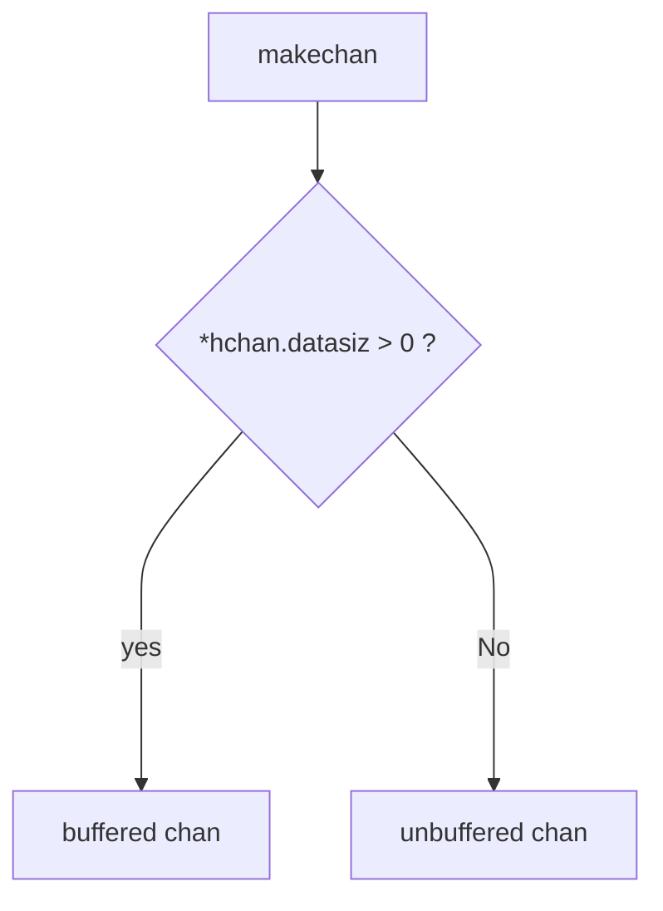
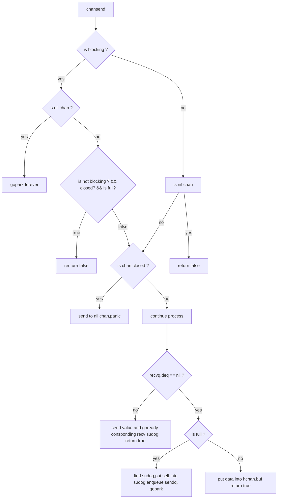

```
type hchan struct {
	qcount   uint           // total data in the queue
	dataqsiz uint           // size of the circular queue
	buf      unsafe.Pointer // points to an array of dataqsiz elements
	elemsize uint16
	closed   uint32
	elemtype *_type // element type
	sendx    uint   // send index
	recvx    uint   // receive index
	recvq    waitq  // list of recv waiters
	sendq    waitq  // list of send waiters

	// lock protects all fields in hchan, as well as several
	// fields in sudogs blocked on this channel.
	//
	// Do not change another G's status while holding this lock
	// (in particular, do not ready a G), as this can deadlock
	// with stack shrinking.
	lock mutex
}
```

chan 的创建


chansend
- `func chansend(c *hchan, ep unsafe.Pointer, block bool, callerpc uintptr) bool`
- chan 发送(ch <- data)被转换成 runtime.chansend() 操作.形参 block 表示是否阻塞调用.
- 返回值表示是否成功向 chan 发送数据.


