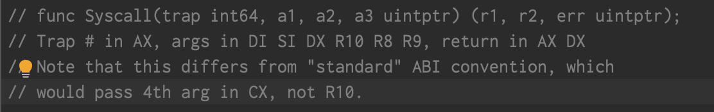
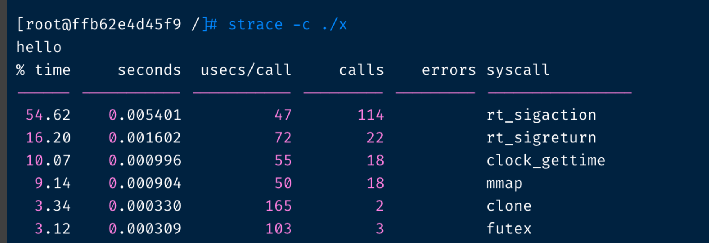

asm_linux_amd64.s


这个定义了 Syscall Syscall6 RawSyscall RawSyscall6


Q: rawsyscall 和 syscall 啥区别
A: The only difference between Syscall and RawSyscall is on line 14, 28 and 34 where Syscall will call runtime·entersyscall(SB) and runtime·exitsyscall(SB) whereas RawSyscall will not. I assume this means that Syscall notifies the runtime that it's switched to a blocking syscall operations and can yield CPU-time to another goroutine/thread whereas RawSyscall will just block.

Q: 阻塞的系统调用和非阻塞的系统调用 光看下面的 系统调用还是 阻塞的多一点.
A:如下表
```c
//sys	Statfs(path string, buf *Statfs_t) (err error)
//sys	SyncFileRange(fd int, off int64, n int64, flags int) (err error)
//sys	Truncate(path string, length int64) (err error)
//sys	Ustat(dev int, ubuf *Ustat_t) (err error)
//sys	accept(s int, rsa *RawSockaddrAny, addrlen *_Socklen) (fd int, err error)
//sys	accept4(s int, rsa *RawSockaddrAny, addrlen *_Socklen, flags int) (fd int, err error)
//sys	bind(s int, addr unsafe.Pointer, addrlen _Socklen) (err error)
//sys	connect(s int, addr unsafe.Pointer, addrlen _Socklen) (err error)
//sysnb	getgroups(n int, list *_Gid_t) (nn int, err error)
//sysnb	setgroups(n int, list *_Gid_t) (err error)
//sys	getsockopt(s int, level int, name int, val unsafe.Pointer, vallen *_Socklen) (err error)
//sys	setsockopt(s int, level int, name int, val unsafe.Pointer, vallen uintptr) (err error)
//sysnb	socket(domain int, typ int, proto int) (fd int, err error)
//sysnb	socketpair(domain int, typ int, proto int, fd *[2]int32) (err error)
//sysnb	getpeername(fd int, rsa *RawSockaddrAny, addrlen *_Socklen) (err error)
//sysnb	getsockname(fd int, rsa *RawSockaddrAny, addrlen *_Socklen) (err error)
//sys	recvfrom(fd int, p []byte, flags int, from *RawSockaddrAny, fromlen *_Socklen) (n int, err error)
//sys	sendto(s int, buf []byte, flags int, to unsafe.Pointer, addrlen _Socklen) (err error)
//sys	recvmsg(s int, msg *Msghdr, flags int) (n int, err error)
//sys	sendmsg(s int, msg *Msghdr, flags int) (n int, err error)
//sys	mmap(addr uintptr, length uintptr, prot int, flags int, fd int, offset int64) (xaddr uintptr, err error)

//sys	futimesat(dirfd int, path string, times *[2]Timeval) (err error)
```
Q:查找 linux 系统调用实现的方法
A: 原汁原味的方法
1. 找个 linux 系统 Ubuntu 和 centos 都行. 
2. 在 /usr/include/x86_64-linux-gnu asm/unistd_64.h 看系统调用号.
3. 在 bits/syscall.h 里面把系统调用搞成 SYS_name 系统调用号 的形式.
4. 直接在源码查看网站 [woboq](https://code.woboq.org/linux/linux/) 搜索相关的符号就行了.

Q: 为啥 go 程序调用了那么多的 rt_sigaction 如图:

A: mstart -> mstart0 -> mstart1 -> mstartm0 -> initsig -> getsig and setsig and setsigstack,看了一下一般进不到 setsigstack,
getsig 会调一次 sigaction setsig 会调一次 sigaction,主要是根据 sigtable 的长度来说的, linux 的 sigtable 长度是 65 一般的是 32
这些系统调用数一般在 比 sigtable 长度的两倍少一些. 如果 sigtable 里面的 sigT.flag == 0 或者 flag 第5 位不是 1 就跳过.跳过的如下:

```json
        {
                flags: 0,
                name: "SIGNONE: no trap",},
	{
                flags: 0,
                name: "SIGKILL: kill",},
	{
                flags: 0,
                name: "SIGSTOP: stop, unblockable",},
	{
                flags: 273,
                name: "SIGCONT: continue",},
	{
                flags: 273,
                name: "SIGTSTP: keyboard stop",},
	{
                flags: 273,
                name: "SIGTTIN: background read from tty",},
        {
                flags: 273,
                name: "SIGTTOU: background write to tty",}
```c
rt_sigaction(SIGRTMIN, NULL, {sa_handler=SIG_DFL, sa_mask=[], sa_flags=0}, 8) = 0
rt_sigaction(SIGRT_1, NULL, {sa_handler=SIG_DFL, sa_mask=[], sa_flags=0}, 8) = 0
rt_sigaction(SIGRT_2, NULL, {sa_handler=SIG_DFL, sa_mask=[], sa_flags=0}, 8) = 0
```

handlingSig 记录的是 getsig 和 setsig 都进行了的情况 linux 下为 55. 55 * 2 == 110 

有三个信号只是 getsig 但是没有 setsig 他们的序号是 32 33 34 号系统调用. 他们的 flag 有`if t.flags&_SigSetStack != 0 {return false}`
在 setsig 之前跳过了. 这就是 strace 显示 113 个 rt_sigaction 的原因.

(65 - 7) * 2 = 116
	


```

Q: 讲下 G 遇到阻塞系统调用如何处理?如何处理的. 从 G M P 的视角说明? 
A: 过程如下:
1. 在 main.main 写的代码有阻塞的系统调用.这是个系统调用.
2. 那么在汇编代码的wrapper 里面一定有 [runtime.entersyscall](https://github.com/golang/go/blob/e8f99da8ed6180732ace00f8fc6b17f636515bc4/src/runtime/proc.go#L3820) 和 [runtime.exitsyscall](https://github.com/golang/go/blob/e8f99da8ed6180732ace00f8fc6b17f636515bc4/src/runtime/proc.go#L3914) 为啥要这样呢? 这时候 m 在等.G在 M 上,
P 里面还有 G 在排队. 这时候应该找可以用的 M 让程序进行下去.这两个点就是 runtime 获取系统调用执行情况的检查点.

解绑 把m 从 p 上剥离. 把 p 从 m 上剥离. 设置 m 的 oldp 为旧的 p.
```go
	pp := _g_.m.p.ptr()
	pp.m = 0
	_g_.m.oldp.set(pp)
	_g_.m.p = 0
```